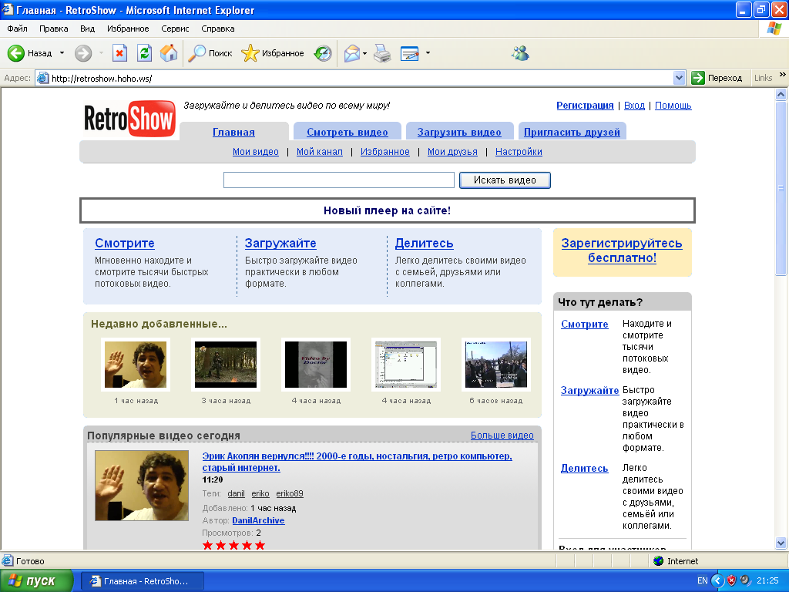

# NetView -now have a YouTube 2005 August Layout

hello this is the NetView but with August 2005 layout is better than RetroShow ,he uses sqlite and creates all tables automatically 
uses FFmpeg so only works on a VPS or you need modify to don't use the FFmpeg btw enjoy this source-code free to use on your revival
